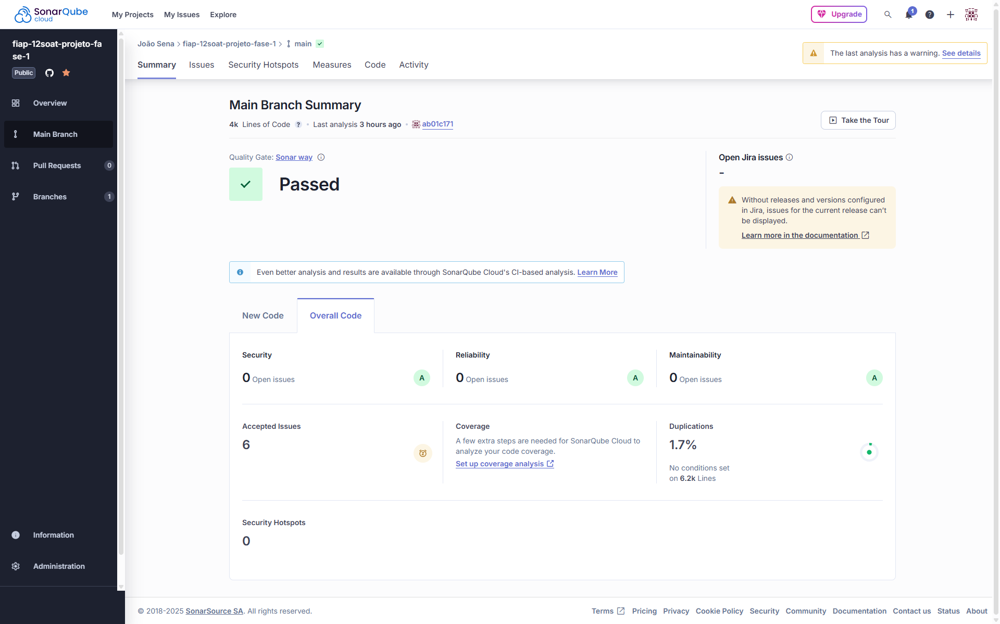
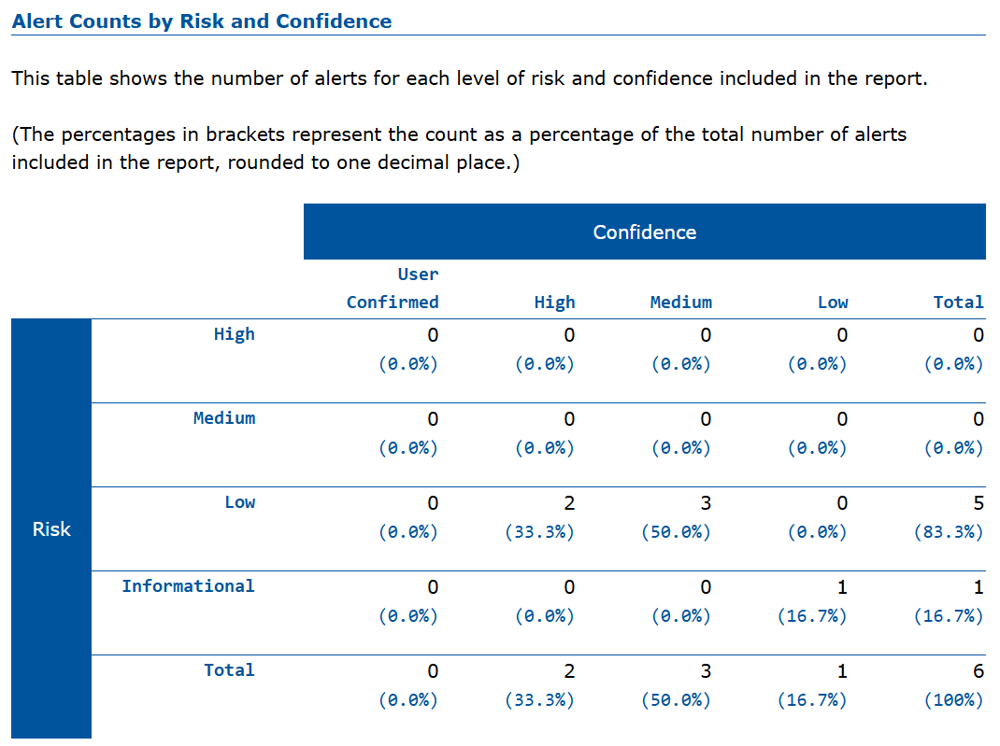

# 11. Qualidade e Segurança

Foram utilizadas as ferramentas SonarCloud e OWASP ZAP para testar a aplicação em relação à qualidade do código e segurança.

> As credenciais de acesso a banco de dados e para geração de Token JWT estão salvas diretamente no appsettings da aplicação. Por ser um projeto acadêmico que será executamente localmente, não há nenhum risco. Quando a aplicação crescer e for publicada em alguma plataforma, com toda certeza esses dados serão ocultados.

## Relatório SonarCloud

Disponível completo em: [Sonarcloud.io](https://sonarcloud.io/summary/overall?id=joaosena19_fiap-12soat-projeto-fase-1&branch=main).

**Observação:** 6 issues foram aceitas. 5 são classificadas como Low Severity, relacionadas ao uso do sufixo "Enum" na criação dos enums. Como estou usando os enums para uma padronização de valores disponíveis em alguns construtores, tirar esse sufixo iria trazer ambuiguidade, então foi decidido manter. 1 issue é de Blocker Severity, que é sobre os secrets de autenticação diretos no repositório. Como mencionado acima, não é um problema neste contexto.

**Resumo:**

## Relatório OWASP ZAP

Disponível completo em: [Relatório OWASP ZAP](attachments/relatorio_owasp_zap.html)

**Observação:** 2 alertas foram marcados como falso positivos, relacionados à SQL Injection. No caso, a aplicação aceita receber um possível SQL Injection na requisição, porém isso é tratado a nível de banco de dados.

**Resumo:**

---
Anterior: [Testes](10_testes.md)  
